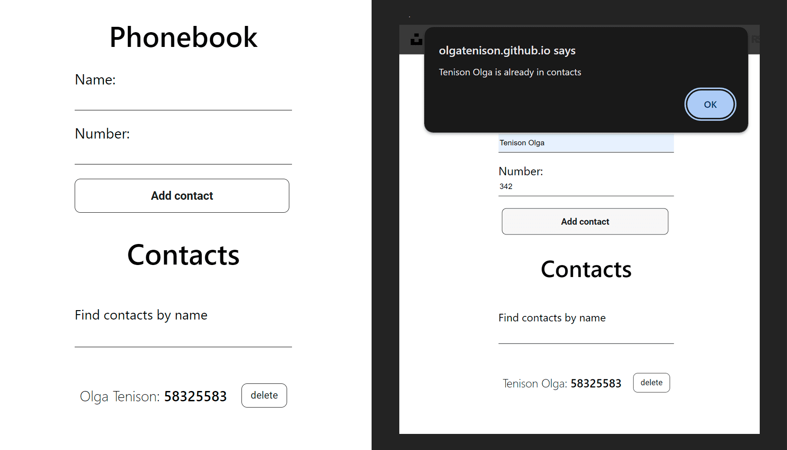

# Phonebook Web Application

This repository contains the source code for a phonebook web application built
using React and Redux Toolkit.

## Features

1. **Add Contacts:** Users can add new contacts by providing a name and phone
   number.

2. **Remove Contacts:** Users can delete saved contacts that are no longer
   needed.

3. **Search Contacts:** Provides the ability to quickly search for contacts by
   name.

4. **State Management:** Efficient state management with Redux Toolkit.

5. **Async Operations:** Uses Redux Thunk for handling asynchronous operations
   like fetching and updating contacts.

6. **HTTP Requests:** Axios library is used for making HTTP requests to a mock
   API.

7. **Testing:** Includes testing utilities with Jest and React Testing Library.

## Technologies

- React
- Redux Toolkit
- Axios
- React Redux
- Jest
- React Testing Library

  

## Redux State Management

This project uses Redux Toolkit for efficient state management. The following
Redux features are implemented:

1. **Fetching Contacts:**

   - Contacts are fetched asynchronously using Redux Thunk middleware.
   - The `fetchContacts` action is responsible for making a GET request to the
     mock API.

2. **Adding a Contact:**

   - Adding a new contact is handled by the `addContact` action, which makes a
     POST request to the API.

3. **Deleting a Contact:**

   - Contacts can be deleted using the `deleteContact` action, making a DELETE
     request to the API.

4. **Redux Store:**

   - The global state is managed using Redux, with the store configured using
     Redux Toolkit.

5. **Async Operations:**
   - Redux Thunk is used to handle asynchronous operations, allowing for complex
     interactions with the API.

Feel free to explore the codebase for detailed implementations of these features
in the Redux-related files.
